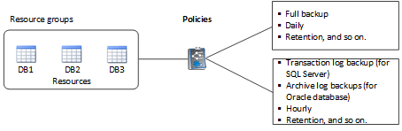

= Recursos, grupos de recursos e políticas
:allow-uri-read: 
:icons: font
:imagesdir: ../media/

[role="lead"]
Antes de usar o SnapCenter, é útil entender conceitos básicos relacionados às operações de backup, clonagem e restauração que você deseja executar. Você interage com recursos, grupos de recursos e políticas para diferentes operações.

* *Os recursos* são normalmente bancos de dados, sistemas de arquivos do Windows ou compartilhamentos de arquivos que você faz backup ou clone com o SnapCenter.
+
No entanto, dependendo do seu ambiente, os recursos podem ser instâncias de banco de dados, grupos de disponibilidade do Microsoft SQL Server, bancos de dados Oracle RAC, sistemas de arquivos do Windows ou um grupo de aplicativos personalizados.

* Um *grupo de recursos* é uma coleção de recursos em um host ou cluster. O grupo de recursos também pode conter recursos de vários hosts e vários clusters.
+
Quando você executa uma operação em um grupo de recursos, executa essa operação em todos os recursos definidos no grupo de recursos de acordo com a programação especificada para o grupo de recursos.

+
Você pode fazer backup sob demanda de um único recurso ou de um grupo de recursos. Você também pode configurar backups programados para recursos únicos e grupos de recursos.

+

NOTE: Se você colocar um host de um grupo de recursos compartilhados no modo de manutenção e se houver programações associadas ao mesmo grupo de recursos compartilhados, todas as operações agendadas serão suspensas para todos os outros hosts do grupo de recursos compartilhados.

+
Você deve usar um plug-in de banco de dados para fazer backup de bancos de dados, um plug-in de sistema de arquivos para fazer backup de sistemas de arquivos e o plug-in SnapCenter para VMware vSphere para fazer backup de VMs e datastores.

* *Políticas* especificam a frequência de backup, retenção de cópia, replicação, scripts e outras caraterísticas das operações de proteção de dados.
+
Ao criar um grupo de recursos, você seleciona uma ou mais políticas para esse grupo. Você também pode selecionar uma política ao executar um backup sob demanda.

Pense em um grupo de recursos como definindo _o que_ você quer proteger e quando você quer protegê-lo em termos de dia e tempo. Pense em uma política como definindo _como_ você quer protegê-la. Se você estiver fazendo backup de todos os bancos de dados ou fazendo backup de todos os sistemas de arquivos de um host, por exemplo, você pode criar um grupo de recursos que inclua todos os bancos de dados ou todos os sistemas de arquivos no host. Em seguida, você pode anexar duas políticas ao grupo de recursos: Uma política diária e uma política por hora.

Ao criar o grupo de recursos e anexar as políticas, você pode configurar o grupo de recursos para executar um backup completo diário e outro agendamento que executa backups de log por hora.

A imagem a seguir ilustra a relação entre recursos, grupos de recursos e políticas para bancos de dados:

A imagem a seguir ilustra a relação entre recursos, grupos de recursos e políticas para sistemas de arquivos do Windows:

image::../media/resources_and_policies_for_wfs.gif[recursos e políticas para wfs]
