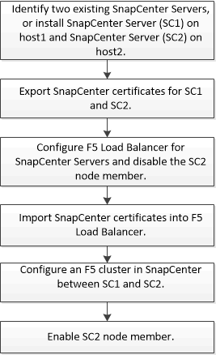

= Configurar servidores SnapCenter para alta disponibilidade
:allow-uri-read: 
:icons: font
:imagesdir: ../media/

[role="lead"]
Para oferecer suporte a alta disponibilidade (HA) no SnapCenter executado no Windows ou no Linux, você pode instalar o balanceador de carga F5. O F5 permite que o servidor SnapCenter suporte configurações ativo-passivo em até dois hosts que estão no mesmo local. Para usar o balanceador de carga F5 no SnapCenter, você deve configurar os servidores SnapCenter e configurar o balanceador de carga F5.

Você também pode configurar o balanceamento de carga de rede (NLB) para configurar o SnapCenter High Availability. Você deve configurar manualmente o NLB fora da instalação do SnapCenter para alta disponibilidade.

Para ambientes de nuvem, você pode configurar a alta disponibilidade usando o Amazon Web Services (AWS) Elastic Load Balancing (ELB) e o balanceador de carga do Azure.

[role="tabbed-block"]
====
.Configure a alta disponibilidade usando o F5
--
A imagem do fluxo de trabalho lista as etapas para configurar os servidores SnapCenter para alta disponibilidade usando o balanceador de carga F5. Para obter instruções detalhadas, https://kb.netapp.com/Advice_and_Troubleshooting/Data_Protection_and_Security/SnapCenter/How_to_configure_SnapCenter_Servers_for_high_availability_using_F5_Load_Balancer["Como configurar servidores SnapCenter para alta disponibilidade usando o balanceador de carga F5"^] consulte .

Você deve ser membro do grupo Administradores locais nos servidores SnapCenter (além de ser atribuído à função SnapCenterAdmin) para usar os seguintes cmdlets para adicionar e remover clusters F5:

* Add-SmServerCluster
* Add-SmServer
* Remover-SmServerCluster
+
Para obter mais informações, https://docs.netapp.com/us-en/snapcenter-cmdlets/index.html["Guia de referência de cmdlet do software SnapCenter"^] consulte .

Informações adicionais

* Depois de instalar e configurar o SnapCenter para alta disponibilidade, edite o atalho da área de trabalho do SnapCenter para apontar para o IP do cluster F5.
* Se ocorrer um failover entre servidores SnapCenter e houver também uma sessão do SnapCenter existente, você deverá fechar o navegador e fazer logon no SnapCenter novamente.
* Na configuração do balanceador de carga (NLB ou F5), se você adicionar um host parcialmente resolvido pelo NLB ou host F5 e se o host SnapCenter não conseguir entrar em Contato com esse host, a página do host SnapCenter alternará entre hosts inativos e o estado em execução com frequência. Para resolver esse problema, você deve garantir que ambos os hosts do SnapCenter sejam capazes de resolver o host no NLB ou no host F5.
* Os comandos SnapCenter para configurações de MFA devem ser executados em todos os hosts. A configuração do grupo dependente deve ser feita no servidor AD FS (Serviços de Federação do ative Directory) usando os detalhes do cluster F5. O acesso à IU do SnapCenter no nível do host será bloqueado após a ativação do MFA.
* Durante o failover, as configurações do log de auditoria não serão refletidas no segundo host. Portanto, você deve repetir manualmente as configurações de log de auditoria no host passivo F5 quando ele se tornar ativo.

--
.Configurar a alta disponibilidade usando o balanceamento de carga de rede (NLB)
--
Você pode configurar o balanceamento de carga de rede (NLB) para configurar o SnapCenter High Availability. Você deve configurar manualmente o NLB fora da instalação do SnapCenter para alta disponibilidade.

Para obter informações sobre como configurar o NLB (balanceamento de carga de rede) com o SnapCenter, https://kb.netapp.com/Advice_and_Troubleshooting/Data_Protection_and_Security/SnapCenter/How_to_configure_NLB_and_ARR_with_SnapCenter["Como configurar o NLB com o SnapCenter"^] consulte .

--
.Configurar a alta disponibilidade usando o AWS Elastic Load Balancing (ELB)
--
Você pode configurar o ambiente de SnapCenter de alta disponibilidade no Amazon Web Services (AWS) configurando dois servidores SnapCenter em zonas de disponibilidade (AZs) separadas e configurando-os para failover automático. A arquitetura inclui endereços IP privados virtuais, tabelas de roteamento e sincronização entre bancos de dados MySQL ativos e em espera.

.Passos
. Configurar IP de sobreposição virtual privada na AWS. Para obter informações, https://docs.aws.amazon.com/vpc/latest/userguide/replace-local-route-target.html["Configurar IP de sobreposição virtual privada"^] consulte .
. Prepare seu host Windows
+
.. Força IPv4 a ser priorizada acima de IPv6:
+
*** Localização: HKLM/SYSTEM/CurrentControlSet/Services/Tcpip6/Parameters
*** Chave: DisabledComponents
*** Tipo: REG_DWORD
*** Valor: 0x20

.. Certifique-se de que os nomes de domínio totalmente qualificados podem ser resolvidos via DNS ou através da configuração de host local para os endereços IPv4.
.. Certifique-se de que não tem um proxy do sistema configurado.
.. Certifique-se de que a palavra-passe de administrador seja a mesma no Windows Server quando utilizar uma configuração sem um ative Directory e que os servidores não estejam num domínio.
.. Adicione IP virtual em ambos os servidores Windows.

. Crie o cluster SnapCenter.
+
.. Inicie o PowerShell e conete-se ao SnapCenter.
`Open-SmConnection`
.. Crie o cluster.
`Add-SmServerCluster -ClusterName <cluster_name> -ClusterIP <cluster_ip> -PrimarySCServerIP <primary_ip> -Verbose -Credential administrator`
.. Adicione o servidor secundário.
`Add-SmServer -ServerName <server_name> -ServerIP <server_ip> -CleanUpSecondaryServer -Verbose -Credential administrator`
.. Obtenha os detalhes de alta disponibilidade.
`Get-SmServerConfig`

. Crie a função Lamda para ajustar a tabela de roteamento caso o endpoint IP privado virtual fique indisponível, monitorado pelo AWS CloudWatch. Para obter informações, https://docs.aws.amazon.com/lambda/latest/dg/getting-started.html#getting-started-create-function["Crie uma função do Lambda"^] consulte .
. Crie um monitor no CloudWatch para monitorar a disponibilidade do endpoint do SnapCenter. Um alarme é configurado para acionar uma função do Lambda se o endpoint estiver inacessível. A função do Lambda ajusta a tabela de roteamento para redirecionar o tráfego para o servidor SnapCenter ativo. Para obter informações, https://docs.aws.amazon.com/AmazonCloudWatch/latest/monitoring/CloudWatch_Synthetics_Canaries_Create.html["Crie canários sintéticos"^] consulte .
. Implemente o fluxo de trabalho usando uma função de etapa como alternativa ao monitoramento do CloudWatch, fornecendo tempos de failover menores. O fluxo de trabalho inclui uma função de sonda do Lambda para testar o URL do SnapCenter, uma tabela do DynamoDB para armazenar contagens de falhas e a própria função Etapa.
+
.. Use uma função lambda para verificar a URL do SnapCenter. Para obter informações, https://docs.aws.amazon.com/lambda/latest/dg/getting-started.html["Crie a função Lambda"^] consulte .
.. Crie uma tabela do DynamoDB para armazenar a contagem de falhas entre duas iterações de função de passo. Para obter informações, https://docs.aws.amazon.com/amazondynamodb/latest/developerguide/GettingStartedDynamoDB.html["Comece a usar a tabela DynamoDB"^] consulte .
.. Crie a função Step (passo). Para obter informações, https://docs.aws.amazon.com/step-functions/["Documentação da função de passos"^] consulte .
.. Teste uma única etapa.
.. Teste a função completa.
.. Crie a função do IAM e ajuste as permissões para poder executar a função do Lambda.
.. Criar agendamento para acionar a função Step. Para obter informações, https://docs.aws.amazon.com/step-functions/latest/dg/using-eventbridge-scheduler.html["Usando o Amazon EventBridge Scheduler para iniciar uma função de passo"^] consulte .

--
.Configure a alta disponibilidade usando o balanceador de carga do Azure
--
Você pode configurar um ambiente SnapCenter de alta disponibilidade usando o balanceador de carga do Azure.

.Passos
. Crie máquinas virtuais em um conjunto de escala usando o portal do Azure. O conjunto de escala de máquina virtual do Azure permite criar e gerenciar um grupo de máquinas virtuais balanceadas de carga. O número de instâncias de máquina virtual pode aumentar ou diminuir automaticamente em resposta à demanda ou a um cronograma definido. Para obter informações, https://learn.microsoft.com/en-us/azure/virtual-machine-scale-sets/flexible-virtual-machine-scale-sets-portal["Crie máquinas virtuais em um conjunto de escala usando o portal do Azure"^] consulte .
. Depois de configurar as máquinas virtuais, faça login em cada máquina virtual no VM Set e instale o servidor SnapCenter em ambos os nós.
. Crie o cluster no host 1.
`Add-SmServerCluster -ClusterName <cluster_name> -ClusterIP <specify the load balancer front end virtual ip> -PrimarySCServerIP <ip address> -Verbose -Credential <credentials>`
. Adicione o servidor secundário.
`Add-SmServer -ServerName <name of node2> -ServerIP <ip address of node2> -Verbose -Credential <credentials>`
. Obtenha os detalhes de alta disponibilidade.
`Get-SmServerConfig`
. Se necessário, reconstrua o host secundário.
`Set-SmRepositoryConfig -RebuildSlave -Verbose`
. Failover para o segundo host.
`Set-SmRepositoryConfig ActiveMaster <name of node2> -Verbose`

--
Mude de NLB para F5 para alta disponibilidade

Você pode alterar sua configuração do SnapCenter HA de balanceamento de carga de rede (NLB) para usar o balanceador de carga F5.

*Passos*

. Configurar servidores SnapCenter para alta disponibilidade usando o F5. https://kb.netapp.com/Advice_and_Troubleshooting/Data_Protection_and_Security/SnapCenter/How_to_configure_SnapCenter_Servers_for_high_availability_using_F5_Load_Balancer["Saiba mais"^].
. No host do servidor SnapCenter, inicie o PowerShell.
. Inicie uma sessão usando o cmdlet Open-SmConnection e insira suas credenciais.
. Atualize o servidor SnapCenter para apontar para o endereço IP do cluster F5 usando o cmdlet Update-SmServerCluster.
+
As informações sobre os parâmetros que podem ser usados com o cmdlet e suas descrições podem ser obtidas executando _get-Help command_name_. Em alternativa, pode também consultar o https://docs.netapp.com/us-en/snapcenter-cmdlets/index.html["Guia de referência de cmdlet do software SnapCenter"^].

====