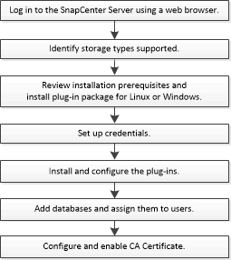

= SnapCenter plug-in para MySQL: fluxo de trabalho de instalação e configuração
:allow-uri-read: 
:icons: font
:imagesdir: ../media/

[role="lead"]
Você deve instalar e configurar o plug-in SnapCenter para MySQL se quiser proteger bancos de dados MySQL.

