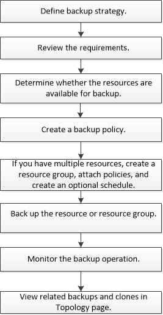

= Visão geral do procedimento de backup
:allow-uri-read: 
:icons: font
:imagesdir: ../media/

[role="lead"]
Você pode criar um backup de um recurso (banco de dados) ou grupo de recursos. O procedimento de backup inclui Planejamento, identificação dos recursos para backup, criação de políticas de backup, criação de grupos de recursos e inclusão de políticas, criação de backups e monitoramento das operações.

O fluxo de trabalho a seguir mostra a sequência na qual você deve executar a operação de backup:

Ao criar um backup para bancos de dados Oracle, um arquivo de bloqueio operacional (_.SM_lock_dbsid_) é criado no host de banco de dados Oracle no diretório _/var/opt/SnapCenter/SCO/lock_ para evitar que várias operações sejam executadas no banco de dados. Após o backup do banco de dados, o arquivo de bloqueio operacional é removido automaticamente.

No entanto, se o backup anterior foi concluído com um aviso, o arquivo de bloqueio operacional pode não ser excluído e a próxima operação de backup entra na fila de espera. Ele pode eventualmente ser cancelado se o arquivo *.SM_lock_dbsid* não for excluído. Nesse cenário, você deve excluir manualmente o arquivo de bloqueio operacional executando as seguintes etapas:

. No prompt de comando, navegue para _/var/opt/SnapCenter/SCO/lock_.
. Eliminar o bloqueio operacional:``rm -rf .sm_lock_dbsid.``

