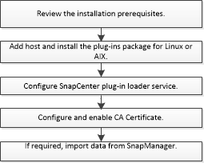

= Fluxo de trabalho de instalação do plug-in SnapCenter para banco de dados Oracle
:allow-uri-read: 
:icons: font
:imagesdir: ../media/

[role="lead"]
Você deve instalar e configurar o plug-in do SnapCenter para o banco de dados Oracle se quiser proteger os bancos de dados Oracle.

