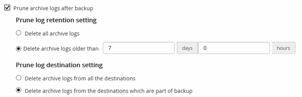

= Criar políticas de backup para bancos de dados Oracle
:allow-uri-read: 
:icons: font
:imagesdir: ../media/

[role="lead"]
Antes de usar o SnapCenter para fazer backup dos recursos do banco de dados Oracle, você deve criar uma política de backup para o recurso ou para o grupo de recursos que deseja fazer backup. Uma política de backup é um conjunto de regras que regem como você gerencia, agenda e retém backups. Você também pode especificar as configurações de replicação, script e tipo de backup. A criação de uma política economiza tempo quando você deseja reutilizar a política em outro recurso ou grupo de recursos.

*Antes de começar*

* Você precisa ter definido sua estratégia de backup.
* Você precisa se preparar para a proteção de dados concluindo tarefas como instalar o SnapCenter, adicionar hosts, descobrir bancos de dados e criar conexões do sistema de storage.
* Se você estiver replicando snapshots em um storage secundário de espelhamento ou cofre, o administrador do SnapCenter deverá ter atribuído as SVMs a você para os volumes de origem e destino.
* Se tiver instalado o plug-in como um utilizador não root, deve atribuir manualmente as permissões de execução aos diretórios prescritor e postscript.
* Reveja os pré-requisitos e limitações específicos da sincronização ativa do SnapMirror. Para obter informações, https://docs.netapp.com/us-en/ontap/smbc/considerations-limits.html#volumes["Limites de objetos para sincronização ativa do SnapMirror"] consulte .

.Sobre esta tarefa
Se a opção 'reter as cópias de backup para um número específico de dias' estiver selecionada, o período de retenção do SnapLock deve ser menor ou igual aos dias de retenção mencionados.

+ Especificar um período de bloqueio de Snapshot impede a exclusão dos Snapshots até que o período de retenção expire.  Isso pode levar à retenção de um número maior de Snapshots do que a contagem especificada na política.

+ Para o ONTAP 9.12.1 e versões anteriores, os clones criados a partir dos Snapshots do SnapLock Vault como parte da restauração herdarão o tempo de expiração do SnapLock Vault.  O administrador de armazenamento deve limpar manualmente os clones após o tempo de expiração do SnapLock .

*Passos*

. No painel de navegação esquerdo, clique em *Configurações*.
. Na página Configurações, clique em *políticas*.
. Selecione *Oracle Database* na lista suspensa.
. Clique em *novo*.
. Na página Nome, insira o nome e os detalhes da política.
. Na página tipo de política, execute as seguintes etapas:
+
.. Selecione o tipo de armazenamento.
.. Selecionar escopo da política:
+
*** Se pretender *criar uma cópia de segurança online*, selecione *cópia de segurança online*.
+
Você deve especificar se deseja fazer backup de todos os arquivos de dados, arquivos de controle e arquivos de log de arquivamento, somente arquivos de dados e arquivos de controle ou somente arquivos de log de arquivamento.

*** Se pretender *criar uma cópia de segurança offline*, selecione *cópia de segurança offline* e, em seguida, selecione uma das seguintes opções:
+
**** Se você quiser criar um backup off-line quando o banco de dados estiver no estado montado, selecione *montar*.
**** Se pretender criar uma cópia de segurança de encerramento offline alterando a base de dados para o estado de encerramento, selecione *Encerrar*.
+
Se você estiver tendo bancos de dados conetáveis (PDBs) e quiser salvar o estado das PDBs antes de criar o backup, selecione *Salvar estado das PDBs*. Isso permite que você traga as PDBs ao seu estado original após a criação do backup.

.. Se você quiser catalogar o backup usando o Oracle Recovery Manager (RMAN), selecione *Catálogo de backup com o Oracle Recovery Manager (RMAN)*.
+
Você pode executar catalogação diferida para um backup de cada vez usando a GUI ou usando o comando SnapCenter CLI Catalog-SmBackupWithOracleRMAN.

+

NOTE: Se você quiser catalogar backups de um banco de dados RAC, verifique se nenhum outro trabalho está sendo executado para esse banco de dados. Se outro trabalho estiver em execução, a operação de catalogação falhará em vez de ficar na fila.

.. Se você quiser podar logs de arquivo após o backup, selecione *Prune archive logs after backup*.
+

NOTE: A eliminação dos registos de arquivo do destino do registo de arquivo que não está configurado na base de dados será ignorada.

+

IMPORTANT: Se você estiver usando o Oracle Standard Edition, você pode usar os parâmetros LOG_ARCHIVE_DEST e LOG_ARCHIVE_DUPLEX_DEST ao executar o backup do log de arquivamento.

+
*** Só pode eliminar registos de arquivo se tiver selecionado os ficheiros de registo de arquivo como parte da cópia de segurança.
+

NOTE: Você deve garantir que todos os nós em um ambiente RAC possam acessar todos os locais de log de arquivamento para que a operação de exclusão seja bem-sucedida.

+
|===
| Se você quiser... | Então... 

 a| 
Eliminar todos os registos de arquivo
 a| 
Selecione *Eliminar todos os registos de arquivo*.

 a| 
Excluir Registros de arquivamento que são mais antigos
 a| 
Selecione *Eliminar registos de arquivo mais antigos que* e, em seguida, especifique a idade dos registos de arquivo a eliminar em dias e horas.

 a| 
Eliminar registos de arquivo de todos os destinos
 a| 
Selecione *Eliminar registos de arquivo de todos os destinos*.

 a| 
Elimine os registos de arquivo dos destinos de registo que fazem parte da cópia de segurança
 a| 
Selecione *Eliminar registos de arquivo a partir dos destinos que fazem parte da cópia de segurança*.

|===
+

. Na página Snapshot e replicação, execute as seguintes etapas:
+
.. Especifique a frequência da programação selecionando *on demand*, *Hourly*, *Daily*, *Weekly* ou *Monthly*.
+

NOTE: Você pode especificar a programação (data de início e data de término) para a operação de backup enquanto cria um grupo de recursos. Isso permite que você crie grupos de recursos que compartilham a mesma política e frequência de backup, mas permite que você atribua diferentes programações de backup a cada política.

+

NOTE: Se você tiver agendado para as 2:00 da manhã, o horário não será acionado durante o horário de verão (DST).

.. Na seção Configurações de retenção de instantâneos de dados, especifique as configurações de retenção para o tipo de backup e o tipo de agendamento selecionado na página tipo de backup:
+
|===

| Se você quiser... | Então... 

 a| 
Mantenha um certo número de instantâneos
 a| 
Selecione *Copies to keep* e especifique o número de instantâneos que deseja manter.

Se o número de instantâneos exceder o número especificado, os instantâneos serão excluídos com as cópias mais antigas excluídas primeiro.

NOTE: O valor máximo de retenção é 1018. Os backups falharão se a retenção for definida para um valor maior do que o que a versão subjacente do ONTAP suporta.

IMPORTANT: Você deve definir a contagem de retenção como 2 ou superior, se quiser habilitar a replicação do SnapVault. Se você definir a contagem de retenção como 1, a operação de retenção poderá falhar porque o primeiro snapshot é o snapshot de referência para a relação SnapVault até que um snapshot mais recente seja replicado para o destino.

 a| 
Mantenha as capturas instantâneas por um determinado número de dias
 a| 
Selecione *reter cópias para* e especifique o número de dias para os quais deseja manter as capturas instantâneas antes de excluí-las.

 a| 
Período de bloqueio de cópia de instantâneo
 a| 
Selecione o *Período de bloqueio de cópia de instantâneo* e especifique a duração em dias, meses ou anos.

O período de retenção do SnapLock deve ser inferior a 100 anos.

|===
.. Na seção Configurações de retenção de instantâneos do Registro de arquivamento, especifique as configurações de retenção para o tipo de backup e o tipo de agendamento selecionado na página tipo de backup:
+
|===

| Se você quiser... | Então... 

 a| 
Mantenha um certo número de instantâneos
 a| 
Selecione *Copies to keep* e especifique o número de instantâneos que deseja manter.

Se o número de instantâneos exceder o número especificado, os instantâneos serão excluídos com as cópias mais antigas excluídas primeiro.

NOTE: O valor máximo de retenção é 1018. Os backups falharão se a retenção for definida para um valor maior do que o que a versão subjacente do ONTAP suporta.

IMPORTANT: Você deve definir a contagem de retenção como 2 ou superior, se quiser habilitar a replicação do SnapVault. Se você definir a contagem de retenção como 1, a operação de retenção poderá falhar porque o primeiro snapshot é o snapshot de referência para a relação SnapVault até que um snapshot mais recente seja replicado para o destino.

 a| 
Mantenha as capturas instantâneas por um determinado número de dias
 a| 
Selecione *reter cópias para* e especifique o número de dias para os quais deseja manter as capturas instantâneas antes de excluí-las.

 a| 
Período de bloqueio de cópia de instantâneo
 a| 
Selecione o *Período de bloqueio de cópia de instantâneo* e especifique a duração em dias, meses ou anos.

O período de retenção do SnapLock deve ser inferior a 100 anos.

|===
.. Selecione a etiqueta da política.
+

NOTE: Você pode atribuir rótulos SnapMirror a snapshots primários para replicação remota, permitindo que os snapshots primários descarreguem a operação de replicação de snapshots do SnapCenter para sistemas secundários ONTAP .  Isso pode ser feito sem habilitar a opção SnapMirror ou SnapVault na página de política.

. Na seção Selecionar opções de replicação secundária, selecione uma ou ambas as seguintes opções de replicação secundária:
+

NOTE: Você deve selecionar as opções de replicação secundária para *período de bloqueio de cópia snapshot secundário* para entrar em vigor.

+
|===
| Para este campo... | Faça isso... 

 a| 
Atualize o SnapMirror depois de criar um instantâneo local
 a| 
Selecione este campo para criar cópias espelhadas dos conjuntos de backup em outro volume (replicação SnapMirror).

Esta opção deve estar ativada para a sincronização ativa do SnapMirror.

Durante a replicação secundária, o tempo de expiração do SnapLock carrega o tempo de expiração do SnapLock primário.

Clicar no botão *Atualizar* na página topologia atualiza o tempo de expiração do SnapLock secundário e primário que são recuperados do ONTAP.

 a| 
Atualize o SnapVault depois de criar um instantâneo local
 a| 
Selecione esta opção para executar a replicação de backup disco a disco (backups SnapVault).

Quando o SnapLock é configurado apenas no secundário do ONTAP conhecido como SnapLock Vault, clicar no botão *Atualizar* na página topologia atualiza o período de bloqueio no secundário que é recuperado do ONTAP.

Para obter mais informações sobre o SnapLock Vault, consulte https://docs.netapp.com/us-en/ontap/snaplock/commit-snapshot-copies-worm-concept.html["Armazene cópias Snapshot em WORM em um destino de cofre"]

link:../protect-sco/task_view_oracle_databse_backups_and_clones_in_the_topology_page.html["Veja os backups e clones do banco de dados Oracle na página topologia"]Consulte .

 a| 
Contagem de tentativas de erro
 a| 
Introduza o número máximo de tentativas de replicação que podem ser permitidas antes de a operação parar.

|===
+

NOTE: Você deve configurar a política de retenção do SnapMirror no ONTAP para o storage secundário para evitar atingir o limite máximo de snapshots no storage secundário.

. Na página Script, insira o caminho e os argumentos do prescritor ou postscript que você deseja executar antes ou depois da operação de backup, respetivamente.
+
Você deve armazenar os prescripts e postscripts em _/var/opt/SnapCenter/spl/scripts_ ou em qualquer pasta dentro deste caminho. Por padrão, o caminho _/var/opt/SnapCenter/spl/scripts_ é preenchido. Se você criou qualquer pasta dentro desse caminho para armazenar os scripts, você deve especificar essas pastas no caminho.

+
Você também pode especificar o valor de tempo limite do script. O valor padrão é de 60 segundos.

+
O SnapCenter permite-lhe utilizar as variáveis de ambiente predefinidas quando executa o prescritor e o postscript. link:../protect-sco/predefined-environment-variables-prescript-postscript-backup.html["Saiba mais"^]

. Na página Verificação, execute as seguintes etapas:
+
.. Selecione o agendamento de backup para o qual você deseja executar a operação de verificação.
.. Na seção comandos do script de verificação, insira o caminho e os argumentos do prescritor ou postscript que você deseja executar antes ou depois da operação de verificação, respetivamente.
+
Você deve armazenar os prescripts e postscripts em _/var/opt/SnapCenter/spl/scripts_ ou em qualquer pasta dentro deste caminho. Por padrão, o caminho _/var/opt/SnapCenter/spl/scripts_ é preenchido. Se você criou qualquer pasta dentro desse caminho para armazenar os scripts, você deve especificar essas pastas no caminho.

+
Você também pode especificar o valor de tempo limite do script. O valor padrão é de 60 segundos.

. Revise o resumo e clique em *Finish*.

