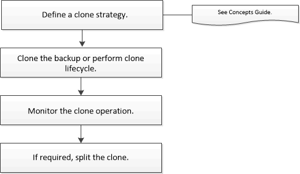

= Fluxo de trabalho clone
:allow-uri-read: 
:icons: font
:imagesdir: ../media/

[role="lead"]
É necessário executar várias tarefas usando o servidor SnapCenter antes de clonar os recursos do banco de dados a partir de um backup. Clonagem de banco de dados é o processo de criação de uma cópia pontual de um banco de dados de produção ou de seu conjunto de backup. Você pode clonar bancos de dados para testar a funcionalidade que precisa ser implementada usando a estrutura e o conteúdo atuais do banco de dados durante os ciclos de desenvolvimento de aplicativos, para usar as ferramentas de extração e manipulação de dados ao preencher data warehouses ou para recuperar dados que foram excluídos ou alterados erroneamente.

Uma operação de clonagem de banco de dados gera relatórios com base nas IDs de tarefa.

O fluxo de trabalho a seguir mostra a sequência na qual você deve executar as operações de clonagem:

Você também pode usar cmdlets do PowerShell manualmente ou em scripts para executar operações de backup, restauração, recuperação, verificação e clone. Para obter informações detalhadas sobre cmdlets do PowerShell, use a ajuda do cmdlet SnapCenter ou consulte o. https://docs.netapp.com/us-en/snapcenter-cmdlets/index.html["Guia de referência de cmdlet do software SnapCenter"]

*Encontre mais informações*

link:task_clone_from_a_sql_server_database_backup.html["Clone de um backup de banco de dados do SQL Server"]

link:task_perform_clone_lifecycle_management.html["Execute o ciclo de vida do clone"]

link:https://kb.netapp.com/Advice_and_Troubleshooting/Data_Protection_and_Security/SnapCenter/Clone_operation_might_fail_or_take_longer_time_to_complete_with_default_TCP_TIMEOUT_value["A operação de clone pode falhar ou levar mais tempo para ser concluída com o valor padrão TCP_TIMEOUT"]
