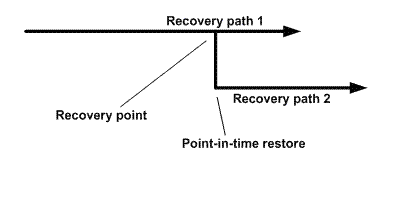

= Tipos de operações de restauração
:allow-uri-read: 
:icons: font
:imagesdir: ../media/

[role="lead"]
Você pode usar o SnapCenter para executar diferentes tipos de operações de restauração em recursos do SQL Server.

* Restaurar mais atualizado
* Restaurar para um ponto anterior no tempo

Você pode restaurar até o minuto ou restaurar para um ponto anterior no tempo nas seguintes situações:

* Restauração a partir do storage secundário SnapMirror ou SnapVault
* Restaurar para caminho alternativo (local)

NOTE: O SnapCenter não é compatível com SnapRestore baseado em volume.

== Restaure até o minuto

Em uma operação de restauração atualizada (selecionada por padrão), os bancos de dados são recuperados até o ponto de falha. O SnapCenter realiza isso executando a seguinte sequência:

. Faz o backup do último log de transações ativo antes de restaurar o banco de dados.
. Restaura os bancos de dados do backup completo do banco de dados selecionado.
. Aplica todos os logs de transação que não foram comprometidos com os bancos de dados (incluindo Registros de transações dos backups desde o momento em que o backup foi criado até o momento mais atual).
+
Os logs de transações são movidos para frente e aplicados a quaisquer bancos de dados selecionados.

Uma operação de restauração atualizada requer um conjunto contíguo de logs de transações.

Como o SnapCenter não pode restaurar logs de transação de banco de dados SQL Server a partir de arquivos de backup de envio de log (o envio de log permite enviar automaticamente backups de log de transações de um banco de dados primário em uma instância de servidor primário para um ou mais bancos de dados secundários em instâncias de servidor secundário separadas), você não é capaz de executar uma operação de restauração atualizada dos backups de log de transações. Por esse motivo, você deve usar o SnapCenter para fazer backup de seus arquivos de log de transação de banco de dados SQL Server.

Se você não precisar manter a capacidade de restauração atualizada para todos os backups, poderá configurar a retenção de backup de log de transações do sistema por meio das políticas de backup.

== Exemplo de uma operação de restauração atualizada

Suponha que você execute o backup do SQL Server todos os dias ao meio-dia, e na quarta-feira às 4:00 horas você precisa restaurar a partir de um backup. Por algum motivo, o backup do meio-dia de quarta-feira falhou a verificação, então você decide restaurar a partir do backup do meio-dia de terça-feira. Depois disso, se o backup for restaurado, todos os logs de transação são movidos para a frente e aplicados aos bancos de dados restaurados, começando com aqueles que não foram confirmados quando você criou o backup de terça-feira e continuando através do último log de transação escrito na quarta-feira às 4:00 horas (se os logs de transação foram copiados).

== Restaurar para um ponto anterior no tempo

Em uma operação de restauração pontual, os bancos de dados são restaurados apenas para um tempo específico do passado. Uma operação de restauração pontual ocorre nas seguintes situações de restauração:

* O banco de dados é restaurado para um determinado tempo em um log de transação de backup.
* O banco de dados é restaurado e apenas um subconjunto de logs de transações de backup é aplicado a ele.

NOTE: Restaurar um banco de dados para um ponto no tempo resulta em um novo caminho de recuperação.

A imagem a seguir ilustra os problemas quando uma operação de restauração pontual é executada:

Na imagem, o caminho de recuperação 1 consiste em um backup completo seguido por vários backups de log de transações. Você restaura o banco de dados para um ponto no tempo. Novos backups de log de transações são criados após a operação de restauração pontual, o que resulta no caminho de recuperação 2. Os novos backups de log de transações são criados sem criar um novo backup completo. Devido a corrupção de dados ou outros problemas, você não pode restaurar o banco de dados atual até que um novo backup completo seja criado. Além disso, não é possível aplicar os logs de transação criados no caminho de recuperação 2 ao backup completo pertencente ao caminho de recuperação 1.

Se você aplicar backups de log de transações, você também pode especificar uma data e hora em particular na qual deseja interromper o aplicativo de transações de backup. Para fazer isso, você especifica uma data e hora dentro do intervalo disponível e o SnapCenter remove quaisquer transações que não foram confirmadas antes desse ponto no tempo. Você pode usar esse método para restaurar bancos de dados a um ponto no tempo antes de uma corrupção ocorrer ou para recuperar de um banco de dados acidental ou exclusão de tabela.

== Exemplo de uma operação de restauração pontual

Suponha que você faça backups completos do banco de dados uma vez à meia-noite e um backup de log de transações a cada hora. O banco de dados falha às 9:45 da manhã, mas você ainda faz backup dos logs de transação do banco de dados com falha. Você pode escolher entre esses cenários de restauração pontual:

* Restaure o backup completo do banco de dados feito à meia-noite e aceite a perda das alterações feitas posteriormente. (Opção: Nenhuma)
* Restaure o backup completo do banco de dados e aplique todos os backups do log de transações até às 9:45 da manhã (opção: Log até)
* Restaure o backup completo do banco de dados e aplique backups de log de transações, especificando o tempo que você deseja que as transações sejam restauradas a partir do último conjunto de backups de log de transações. (Opção: Por hora específica)

Neste caso, você calcularia a data e a hora em que um determinado erro foi relatado. Quaisquer transações que não tenham sido efetuadas antes da data e hora especificadas são removidas.
