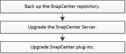

= Atualizar fluxo de trabalho
:allow-uri-read: 
:icons: font
:imagesdir: ../media/

[role="lead"]
Cada versão do SnapCenter contém um servidor SnapCenter atualizado e um pacote de plug-ins. As atualizações do pacote de plug-in são distribuídas com o instalador do SnapCenter. Você pode configurar o SnapCenter para verificar se há atualizações disponíveis.

O fluxo de trabalho mostra as diferentes tarefas necessárias para atualizar o servidor SnapCenter e os pacotes Plug-in.

== Caminhos de atualização suportados

|===
| Se você estiver na versão do servidor SnapCenter... | Você pode atualizar diretamente o servidor SnapCenter para... | Versões de plug-in suportadas 

.2+| 4,8 | 4,9  a| 
* 4,8
* 4,9

| 5,0  a| 
* 5,0

.2+| 4,9 | 5,0  a| 
* 4,9
* 5,0

| 6,0  a| 
* 6,0

| 5,0  a| 
6,0
 a| 
* 5,0
* 6,0

|===

IMPORTANT: Por exemplo, se você estiver no SnapCenter versão 4,8 e quiser atualizar para o 6,0, primeiro você deve atualizar para o 4,9 e, em seguida, fazer uma atualização contínua para o 6,0.

NOTE: Para obter informações sobre como atualizar o plug-in do SnapCenter para VMware vSphere, https://docs.netapp.com/us-en/sc-plugin-vmware-vsphere/scpivs44_upgrade.html["Atualize o plug-in do SnapCenter para o VMware vSphere"^] consulte .
